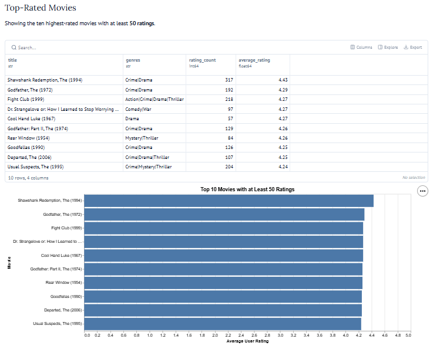

# MovieLens SQL Rating Explorer

> An interactive SQL analysis of MovieLens user ratings by Shalynne Orth.

## Project Overview

This project uses SQLite, SQL, Python, and a reactive Marimo app to explore
MovieLens movie ratings.

The project asks:

> Which movies have the highest average user ratings when they have enough
> ratings to make the result meaningful?

The app joins the `movies.csv` and `ratings.csv` tables using `movieId`.
Users can choose a minimum number of ratings with a slider, then view the ten
highest-rated qualifying movies in a table and bar chart.

## Key Results

With a minimum of 50 ratings, *The Shawshank Redemption (1994)* was the
highest-rated qualifying movie, with an average rating of **4.43 out of 5**
from **317 ratings**.

| Movie | Rating count | Average rating |
| --- | ---: | ---: |
| The Shawshank Redemption (1994) | 317 | 4.43 |
| The Godfather (1972) | 192 | 4.29 |
| Fight Club (1999) | 218 | 4.27 |



## Analyst Insight

Increasing the minimum rating count from 50 to 100 removed movies that had
fewer than 100 ratings from the top-ten ranking. The revised list emphasized
movies supported by more audience feedback.

This demonstrates that the rating-count threshold changes the amount of
evidence required for a movie to appear in the results. A higher threshold
makes the ranking less influenced by a small number of ratings, although it
does not make the results an objective measure of movie quality.

## Run the Interactive App

From the project root folder, run:

```shell
uv sync
uv run marimo run src/datafun/movies_notebook.py
